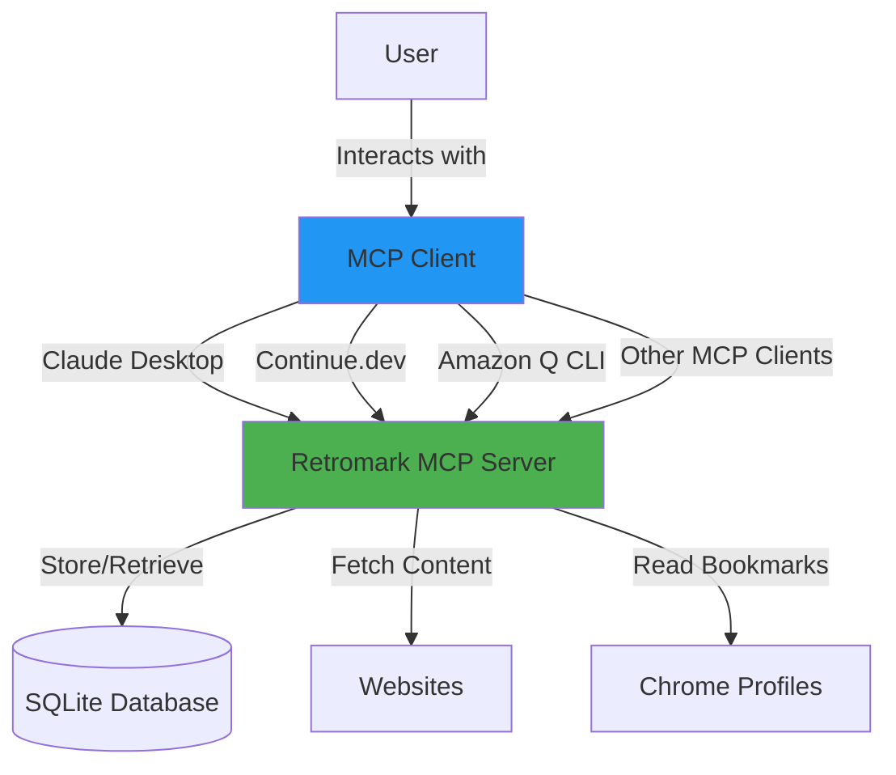

# Retromark MCP Server

**Universal MCP server for AI-assisted bookmark management**

Retromark works with Claude Desktop, Claude Code, Continue.dev, Amazon Q CLI, and any other MCP-compatible client.


## Overview

Retromark is an MCP (Model Context Protocol) server that provides intelligent bookmark management through AI assistants. Save, organize, and search bookmarks using natural language, whether you're in your IDE, terminal, or desktop chat application.

### Key Features

- **Universal MCP Support**: Works with any MCP-compatible client
- **Intelligent Content Extraction**: Automatically analyzes and categorizes web pages
- **Chrome Integration**: Import bookmarks from all Chrome profiles
- **Natural Language Interface**: Conversational bookmark management
- **Cross-Platform**: macOS, Windows, and Linux support
- **Dual Mode**: MCP server or standalone CLI

## Quick Start

### Installation

```bash
# Install uv (recommended package manager)
curl -LsSf https://astral.sh/uv/install.sh | sh

# Clone and install
git clone https://github.com/cearley/retromark-mcp-server.git
cd retromark-mcp-server
uv sync
chmod +x main.py src/url_manager.py src/server.py
```

### Choose Your Client

Retromark supports multiple MCP clients. Choose the one that fits your workflow:

| Client | Best For | Setup Guide |
|--------|----------|-------------|
| **Claude Desktop** | General AI chat & research | [Claude Setup](docs/claude-setup.md) |
| **Continue.dev** | IDE integration (VS Code/JetBrains) | [Continue.dev Setup](docs/continue-setup.md) |
| **Amazon Q CLI** | Terminal workflows & AWS development | [Amazon Q Setup](docs/amazonq-setup.md) |

**Not sure which to choose?** See the [Client Comparison Guide](docs/client-comparison.md).

## Supported MCP Clients

### Claude Desktop & Claude Code (Primary)

**Use Case**: Desktop AI chat, general research, content curation

**Configuration**: `~/Library/Application Support/Claude/claude_desktop_config.json` (macOS)

```json
{
  "mcpServers": {
    "retromark": {
      "command": "uv",
      "args": ["--directory", "/path/to/retromark-mcp-server", "run", "src/server.py"]
    }
  }
}
```

**[Full Claude Setup Guide →](docs/claude-setup.md)**

### Continue.dev (Secondary)

**Use Case**: IDE-integrated bookmark management while coding

**Configuration**: `~/.continue/config.json`

```json
{
  "mcpServers": {
    "retromark": {
      "command": "uv",
      "args": ["--directory", "/path/to/retromark-mcp-server", "run", "src/server.py"]
    }
  }
}
```

Access via `@` menu in Continue.dev. First MCP client with full support for Resources, Prompts, Tools, and Sampling.

**[Full Continue.dev Setup Guide →](docs/continue-setup.md)**

### Amazon Q CLI (Tertiary)

**Use Case**: Terminal-based workflows, AWS development, scripting

**Configuration**: `~/.aws/amazonq/mcp.json`

```json
{
  "bookmark_manager": {
    "command": "uv",
    "args": ["--directory", "/path/to/retromark-mcp-server", "run", "src/server.py"],
    "disabled": false,
    "autoApprove": ["get_url_data", "store_url", "search_bookmarks",
                    "list_categories", "list_bookmarks_by_category",
                    "delete_bookmark", "list_chrome_bookmarks",
                    "import_chrome_bookmark"]
  }
}
```

**[Full Amazon Q Setup Guide →](docs/amazonq-setup.md)**

## Architecture



## Example Workflows

### With Claude Desktop

```
You: Save this Python asyncio guide: https://docs.python.org/3/library/asyncio.html

Claude: I'll analyze and save that for you...

[Analyzes content]

Saved!
- Title: asyncio — Asynchronous I/O
- Category: Programming
- Tags: python, asyncio, concurrent-programming
- Importance: 4
```

### With Continue.dev

```
# In VS Code while coding

You: @MCP Search my bookmarks for React hooks

Continue: Found 5 React Hooks bookmarks:
1. React Hooks Documentation
2. Custom Hooks Guide
3. useEffect Deep Dive
...
```

### With Amazon Q CLI

```bash
$ q chat

> Save these AWS Lambda docs in my serverless category:
> https://docs.aws.amazon.com/lambda/

Analyzing and saving...
Bookmark saved in "serverless" category!
```

## MCP Tools

Retromark exposes 8 tools through the MCP protocol:

| Tool | Description |
|------|-------------|
| `get_url_data` | Fetch and analyze webpage content |
| `store_url` | Save bookmark with AI-generated metadata |
| `search_bookmarks` | Full-text search across all bookmarks |
| `list_categories` | List all bookmark categories |
| `list_bookmarks_by_category` | Get bookmarks in a category |
| `delete_bookmark` | Remove a bookmark |
| `list_chrome_bookmarks` | List Chrome bookmarks from all profiles |
| `import_chrome_bookmark` | Import Chrome bookmark into Retromark |

## Data Storage

- **MCP Mode**: SQLite database at `~/Documents/github/retromark-mcp-server/data/bookmarks.db`
- **CLI Mode**: JSON file at `~/Documents/github/retromark-mcp-server/data/url_database.json`

**Note**: MCP and CLI modes use separate storage and do not sync.

## Additional Features

### Standalone CLI Mode

In addition to MCP server mode, Retromark provides a standalone CLI:

```bash
./main.py --mode cli
# or
./src/url_manager.py <command> [options]
```

**CLI Commands**:
- `add <url> <category>` - Add bookmark
- `search <query>` - Search bookmarks
- `list <category>` - List category bookmarks
- `categories` - List all categories
- `chrome [-f folder]` - List Chrome bookmarks
- `import <url> <category>` - Import Chrome bookmark

See `./src/url_manager.py --help` for full CLI documentation.

## Documentation

- **Setup Guides**
  - [Claude Desktop & Claude Code](docs/claude-setup.md)
  - [Continue.dev](docs/continue-setup.md)
  - [Amazon Q CLI](docs/amazonq-setup.md)

- **Reference**
  - [Client Comparison](docs/client-comparison.md) - Which client to use
  - [Troubleshooting](docs/troubleshooting.md) - Common issues and solutions
  - [CHANGELOG](CHANGELOG.md) - Version history

## Requirements

- Python 3.10+ (3.13 recommended)
- One of: Claude Desktop, Continue.dev, Amazon Q CLI, or any MCP client
- [uv](https://docs.astral.sh/uv/) (recommended) or pip

## Project Structure

```
retromark-mcp-server/
├── src/                    # Source code
│   ├── server.py           # MCP server implementation
│   ├── url_manager.py      # CLI implementation
│   └── utils/              # Utilities
│       └── browser_integration.py
├── docs/                   # Documentation
│   ├── claude-setup.md
│   ├── continue-setup.md
│   ├── amazonq-setup.md
│   ├── client-comparison.md
│   └── troubleshooting.md
├── data/                   # Databases (gitignored)
├── main.py                 # Entry point
├── pyproject.toml          # Dependencies
└── README.md               # This file
```

## Development

### Running Tests

```bash
# Test MCP server manually
uv run src/server.py

# Test CLI mode
./main.py --mode cli
```

### Tech Stack

- **FastMCP**: MCP server framework
- **BeautifulSoup4**: HTML parsing
- **SQLite**: Database storage
- **Requests**: HTTP client

## Troubleshooting

**Server won't start?**
→ Check configuration paths are absolute
→ Verify Python/uv in PATH
→ See [Troubleshooting Guide](docs/troubleshooting.md)

**Tools not appearing?**
→ Restart your MCP client completely
→ Validate JSON configuration syntax
→ Check client logs

**Permission errors?**
→ Run `chmod +x src/server.py`
→ Verify data directory is writable

**Full troubleshooting guide**: [docs/troubleshooting.md](docs/troubleshooting.md)

## Contributing

Contributions welcome! Please:
1. Fork the repository
2. Create a feature branch
3. Make your changes
4. Submit a pull request

## Credits

This project is a fork of [LinkVault MCP Server](https://github.com/labeveryday/linkvault-mcp-server) by [@labeveryday](https://github.com/labeveryday). Special thanks for creating the original implementation.

## License

MIT License - see [LICENSE](LICENSE) file for details.

## Support

- **Issues**: [GitHub Issues](https://github.com/cearley/retromark-mcp-server/issues)
- **Documentation**: [/docs](docs/)
- **Changelog**: [CHANGELOG.md](CHANGELOG.md)

---

**Version 0.2.0** - Universal MCP client support
**Made with** ❤️ **for the MCP community**
